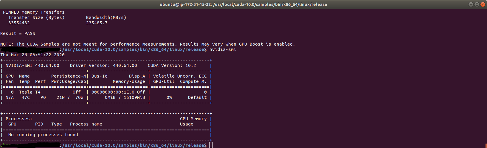
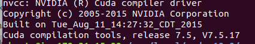

# aws_deep_learning
## Set Enviroment
1. **AWS Instances**    
    Description:
    - OS Type |
    - Instances Type|
    - Memory Size |
2. **Connecting to AWS**
3. **SETTING HOST ENVIRONMENT**     
  - INSTALL GENERAL LIBRARIES : You can skip this, but IDK it would be work or not.
  - INSTALL NVIDIA DRIVER [1] :
    ```bash
    * sudo apt-get install linux-headers-$(uname -r)
    * distribution=$(. /etc/os-release;echo $ID$VERSION_ID | sed -e 's/\.//g')
    * wget https://developer.download.nvidia.com/compute/cuda/repos/$distribution/x86_64/cuda-$distribution.pin
    * sudo mv cuda-$distribution.pin /etc/apt/preferences.d/cuda-repository-pin-600
    * sudo apt-key adv --fetch-keys https://developer.download.nvidia.com/compute/cuda/repos/$distribution/x86_64/7fa2af80.pub
    * echo "deb http://developer.download.nvidia.com/compute/cuda/repos/$distribution/x86_64 /" | sudo tee /etc/apt/sources.list.d/cuda.list
    * sudo apt-get update
    * sudo apt-get -y install cuda-drivers
    ```
  -Check NVIDIA driver is succesfully installed:
  ```nvidia-smi ```
  - Make sure shows like this:
  <div align="center">  </div>
  - Adding PATH and Test CUDA DRIVER
  ```bash
  export PATH=/usr/local/cuda-10.2/bin:/usr/local/cuda-10.2/NsightCompute-2019.1${PATH:+:${PATH}}
  export LD_LIBRARY_PATH=/usr/local/cuda-10.2/lib64${LD_LIBRARY_PATH:+:${LD_LIBRARY_PATH}}
  export LD_LIBRARY_PATH=/usr/local/cuda-10.2/lib${LD_LIBRARY_PATH:+:${LD_LIBRARY_PATH}}
  ```

  - Install Cuda-Tollkit by ```sudo apt install nvidia-cuda-toolkit``` and check by ```nvcc -V```  </div>
  - Verify CUDA by run ``` ./bandwidth ``` and ``` ./deviceQuery``` on ```/usr/local/cuda-10.0/samples/bin/x86_64/linux/release ``` after run this:
  ``` bash
  cd ~/
  apt-get install cuda-samples-7-0 -y
  cd /usr/local/cuda-7.0/samples
  make
  ```
  - Make sure the result of ``` ./bandwidth ``` and ``` ./deviceQuery``` is PASS

4. **SETTING DOCKER ENVIRONMENT**

5. **BUILD EXAMPLES DOCKER**
  - OPENPOSE
  - ST-GCN

## REFERENCES
[1] NVIDIA DATA CENTER LIBRARIES [https://docs.nvidia.com/datacenter/tesla/tesla-installation-notes/index.html]
[2]
