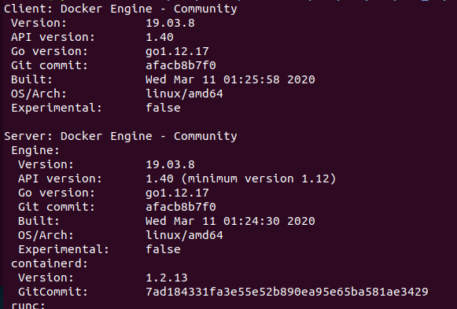

# aws_deep_learning
## Set Enviroment
1. **AWS Instances**    
    Description:
    - OS Type |
    - Instances Type|
    - Memory Size |
2. **Connecting to AWS**
3. **SETTING HOST ENVIRONMENT**     
  - INSTALL GENERAL LIBRARIES : *You can skip this, but IDK it would be work or not.*
  - INSTALL NVIDIA DRIVER [1] :
    ```bash
    * sudo apt-get install linux-headers-$(uname -r)
    * distribution=$(. /etc/os-release;echo $ID$VERSION_ID | sed -e 's/\.//g')
    * wget https://developer.download.nvidia.com/compute/cuda/repos/$distribution/x86_64/cuda-$distribution.pin
    * sudo mv cuda-$distribution.pin /etc/apt/preferences.d/cuda-repository-pin-600
    * sudo apt-key adv --fetch-keys https://developer.download.nvidia.com/compute/cuda/repos/$distribution/x86_64/7fa2af80.pub
    * echo "deb http://developer.download.nvidia.com/compute/cuda/repos/$distribution/x86_64 /" | sudo tee /etc/apt/sources.list.d/cuda.list
    * sudo apt-get update
    * sudo apt-get -y install cuda-drivers
    ```
  - Check NVIDIA driver is succesfully installed by ```nvidia-smi ``` and make sure shows like this:
  <div align="center">  </div>

  - Adding PATH and Test CUDA DRIVER
  ```bash
  export PATH=/usr/local/cuda-10.2/bin:/usr/local/cuda-10.2/NsightCompute-2019.1${PATH:+:${PATH}}
  export LD_LIBRARY_PATH=/usr/local/cuda-10.2/lib64${LD_LIBRARY_PATH:+:${LD_LIBRARY_PATH}}
  export LD_LIBRARY_PATH=/usr/local/cuda-10.2/lib${LD_LIBRARY_PATH:+:${LD_LIBRARY_PATH}}
  ```

  - Install Cuda-Tollkit by ```sudo apt install nvidia-cuda-toolkit``` and check by ```nvcc -V```  </div>
  - Verify CUDA by run ``` ./bandwidth ``` and ``` ./deviceQuery``` on ```/usr/local/cuda-10.0/samples/bin/x86_64/linux/release ``` after run this:
  ```bash
  cd ~/
  apt-get install cuda-samples-7-0 -y
  cd /usr/local/cuda-7.0/samples
  make
  ```
  - Make sure the result of ``` ./bandwidth ``` and ``` ./deviceQuery``` is PASS

4. **SETTING DOCKER ENVIRONMENT**
  - DOCKER INSTALLATION   

  ``` bash
  * sudo apt -y update
  * sudo apt -y install apt-transport-https ca-certificates curl gnupg-agent software-properties-common
  * sudo apt remove docker docker-engine docker.io containerd runc
  * curl -fsSL https://download.docker.com/linux/ubuntu/gpg | sudo apt-key add -
  * sudo add-apt-repository "deb [arch=amd64] https://download.docker.com/linux/ubuntu $(lsb_release -cs) stable"
  * sudo apt update
  * sudo apt -y install docker-ce docker-ce-cli containerd.io
  * sudo usermod -aG docker $USER
  * newgrp docker
  * docker version
  ```

  - The output should be like: <div align="center">  </div>

  - Install NVIDIA-DOCKER [3]:

    ```bash
    # Add the package repositories
    distribution=$(. /etc/os-release;echo $ID$VERSION_ID)
    curl -s -L https://nvidia.github.io/nvidia-docker/gpgkey | sudo apt-key add -
    curl -s -L https://nvidia.github.io/nvidia-docker/$distribution/nvidia-docker.list | sudo tee /etc/apt/sources.list.d/nvidia-docker.list

    sudo apt-get update && sudo apt-get install -y nvidia-container-toolkit
    sudo systemctl restart docker
    ```

  - Check NVIDIA-Docker Instalation by: ```docker run --gpus all nvidia/cuda:10.0-base nvidia-smi ```

5. **BUILD EXAMPLES DOCKER**
  - OPENPOSE[4]

      ```bash
      docker pull cwaffles/OPENPOSE
      sudo docker run -it --rm --gpus all -e NVIDIA_VISIBLE_DEVICES=0 cwaffles/openpose
      ```

  - ST-GCN

    ```bash
    git clone https://github.com/ajisetyoko/docker_gcn_private.git
    cd docker_gcn_private/
    sudo docker build -t gcn_docker .
    sudo docker run -it --rm --gpus all -e NVIDIA_VISIBLE_DEVICES=0 gcn_docker
    ```


## REFERENCES
[1] NVIDIA DATA CENTER LIBRARIES [https://docs.nvidia.com/datacenter/tesla/tesla-installation-notes/index.html]   
[2] Install Docker [https://computingforgeeks.com/how-to-install-docker-on-ubuntu/]   
[3] NVIDIA-DOCKER [https://github.com/NVIDIA/nvidia-docker#quickstart]    
[4] OPENPOSE DOCKER [https://hub.docker.com/r/cwaffles/openpose]    
